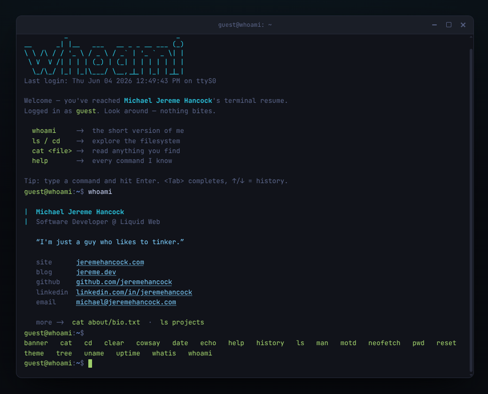

# whoami

An interactive **résumé that pretends to be a Linux terminal**. It boots with
an ASCII MOTD, gives you a real prompt, and lets visitors explore with the
commands they already know — `ls`, `cd`, `cat`, `man`, and a cheeky `whoami`.

Pure HTML, CSS, and vanilla JavaScript. **No frameworks, no build step, no
dependencies** — just open the file (or drop it on any static host).

```
          _                           _
__      _| |__   ___   __ _ _ __ ___ (_)
\ \ /\ / / '_ \ / _ \ / _` | '_ ` _ \| |
 \ V  V /| | | | (_) | (_| | | | | | | |
  \_/\_/ |_| |_|\___/ \__,_|_| |_| |_|_|
```

## Features

- 🖥️  **Looks like a real terminal** — window chrome, blinking block cursor,
  coloured output, scanlines on the retro themes.
- 📂  **A virtual filesystem** you actually walk through with `ls` / `cd` / `cat`
  (relative paths, `..`, `~`, and `/` all work).
- 📖  **`man` pages** and `whatis` for every built-in command.
- ⌨️  **Real shell ergonomics** — `Tab` completion (commands *and* paths),
  `↑`/`↓` history, and `Ctrl+L` / `Ctrl+C` / `Ctrl+U` / `Ctrl+A` / `Ctrl+E`.
- 🎨  **5 themes** — `default`, `matrix`, `amber`, `dracula`, `light`
  (try `theme amber`; your pick is remembered).
- 🥚  **Easter eggs** — `sudo`, `cowsay`, `neofetch`, `vim`, and a `.secret/`
  worth finding.
  
## Screenshot



## Commands

| | |
|---|---|
| `whoami` | the short version of me |
| `ls` · `cd` · `pwd` · `tree` · `find` | get around the filesystem |
| `cat` · `grep` | read & search files |
| `man` · `whatis` · `help` | figure out what everything does |
| `neofetch` | the obligatory flex |
| `theme` | change the colour scheme |
| `echo` · `date` · `history` · `uname` · `uptime` · `clear` · `motd` | the usual suspects |
| `cowsay` · `banner` · `sudo` · `vim` … | for fun |

Type `help` in the terminal for the full list, or `man <command>` for details.

## Run it

It's a static site, but the content lives in `content.json`, which the browser
can only **fetch when the page is served over HTTP** — so serve it:

```bash
python3 -m http.server 8000   # then visit http://localhost:8000
```

You *can* still double-click `index.html`, but `file://` URLs can't fetch
`content.json`, so you'll see a small built-in fallback instead of your content.
(Any real web host serves over HTTP, so deployment just works.)

### Host it anywhere

It's just static files — deploy them wherever you like: any static host, an
Nginx/Apache server, an object store/CDN, or a container. Upload the folder (or
point your host at the repo) and you're live. Paths resolve correctly whether
it's served from the site root or a subdirectory (e.g. `https://you.com/whoami/`).

## Make it yours

All the site content lives in one place: [`content.json`](content.json).
Edit it and reload — no build step.

```jsonc
{
  "title": "whoami — Your Name", // the browser-tab title (falls back to index.html)
  "user": "guest",            // the visitor's name in the prompt
  "host": "whoami",           // guest@whoami
  "profile": {                // shown by `whoami` and `neofetch`
    "name": "Your Name",
    "role": "What you do",
    "tagline": "One-liner about you.",
    "github": "https://github.com/you",
    "email": "you@example.com"
  },
  "tree": {                   // this object *is* the filesystem
    "README.md": ["A file as", "an array of lines."],
    "about": {                            // a nested object is a directory
      "bio.txt": "A file as a single string.",
      "story.md": { "file": "content/story.md" }   // load from a real file
    }
  }
}
```

**A file** can be written three ways — pick whatever's comfortable:

| In `content.json`                | Meaning                                   |
|----------------------------------|-------------------------------------------|
| `"name": "one line of text"`     | inline file, single string                |
| `"name": ["line", "line", ...]`  | inline file, one array entry per line     |
| `"name": { "file": "content/x.md" }` | content loaded from a real `.md`/`.txt` |

**A directory** is just a nested object (anything without `file`/`content`).
Add a key, and `ls`/`cd`/`cat`/`tree`/tab-completion pick it up automatically.

So you can keep short things inline and write long pages as real markdown files
under [`content/`](content/) — there are three examples in there already
(`README.md`, `about/bio.txt`, and `resume/experience.txt`).

Other knobs:

- **Themes & colours** — palettes live in
  [`assets/css/style.css`](assets/css/style.css) under `[data-theme="…"]`.
- **Quick-bar buttons** (mobile) — the `QUICKBAR` list at the top of
  [`assets/js/terminal.js`](assets/js/terminal.js).
- **New commands** — add a spec to
  [`assets/js/commands.js`](assets/js/commands.js); it shows up in `help` and
  gets a `man` page automatically.

> JSON has no comments, so the `// …` notes above are just for illustration —
> don't put them in the real file.

## Project layout

```
index.html
content.json             >>> your content: profile + the filesystem tree <<<
content/                 optional real .md/.txt files referenced from content.json
├── README.md
├── about/bio.txt
└── resume/experience.txt
assets/
├── css/style.css        window chrome, cursor, colours, themes
└── js/
    ├── util.js          escaping, colours, linkify, tokenizer
    ├── filesystem.js    the filesystem engine (builds the tree, resolves paths)
    ├── commands.js      every command + its man page
    ├── terminal.js      the shell engine (input, history, completion, quick-bar)
    ├── window.js        desktop window chrome (move, resize, min/max/close)
    └── main.js          loads content.json, then wires it up and boots
```

## License

[MIT](LICENSE) © Jereme Hancock

## AI Disclosure

This project was created with the help of AI.
